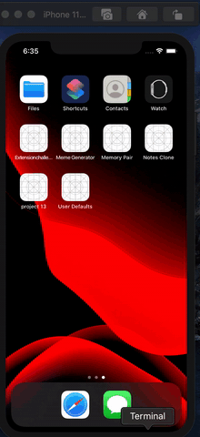

# Note-Clone(text only)

This project is a clone of the IOS notes app. I used several UIKIT components like navigation controller, table view controller, custom table view cell(xib), and toolbar.
Right now, this app supports only the text. All the data is stored with user defaults and loaded to the app when the user opens the app next time.

You can edit the notes from the navbar button. I like this feature very much because it took a little while to figure it out.

### Demo

